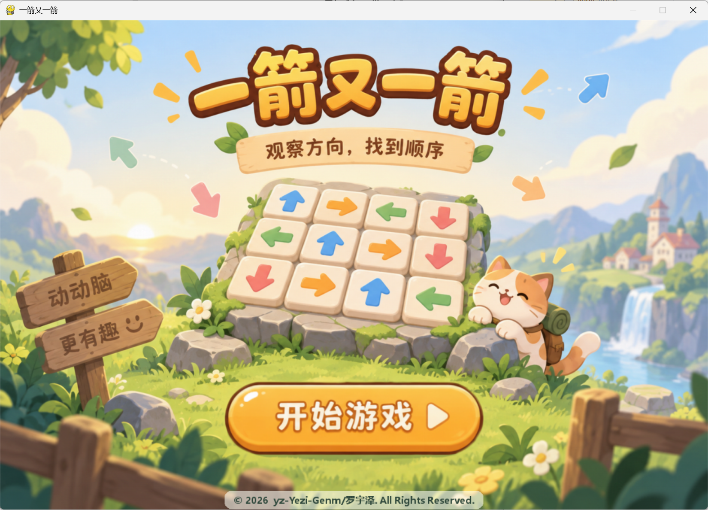
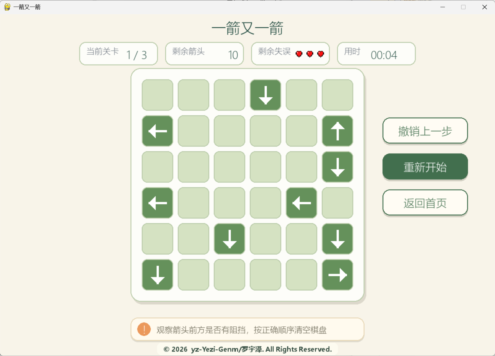
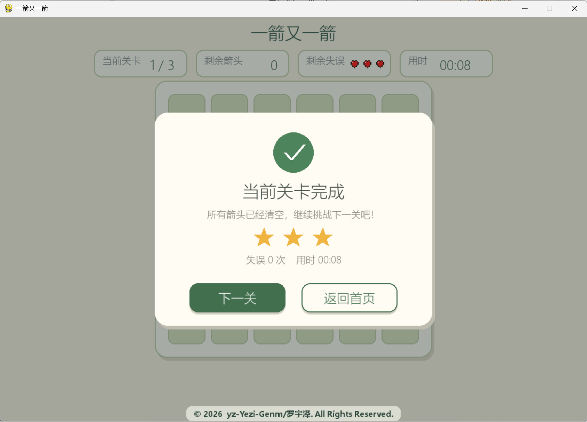

# 一箭又一箭（OneArrowAgain）

## 项目简介

《一箭又一箭》是一款基于 **Python + Pygame** 开发的单格箭头益智解谜游戏。

玩家需要观察棋盘中箭头的方向以及前方是否存在其他箭头阻挡，并按照正确的顺序点击箭头，使所有箭头成功飞出棋盘。

游戏共设置 3 个关卡，随着关卡推进，箭头数量逐渐增加。

## 作者

**罗宇泽 / Luo Yuze**

GitHub：`yz-Yezi-Genm`

---

## 开发环境

- 操作系统：Windows
- 开发语言：Python
- Python 版本：Python 3.10
- 图形库：Pygame
- 开发工具：PyCharm
- 打包工具：PyInstaller

---

## 安装与运行

### 方法一：运行 Python 源代码

首先安装 Pygame：

```bash
pip install pygame
```

进入项目目录后运行：

```bash
python main.py
```

### 方法二：运行打包后的程序

项目已经使用 **PyInstaller** 打包为 Windows 可执行程序。

直接运行：

```text
OneArrowAgain.exe
```

即可启动游戏，无需额外打开 PyCharm。

---

## 游戏操作说明

- 使用鼠标点击棋盘中的箭头；
- 如果箭头前方没有其他箭头阻挡，则箭头会飞出棋盘；
- 如果箭头前方存在阻挡，则本次操作失败并扣除一次生命值；
- 每关共有 3 次失误机会；
- 清空当前关卡所有箭头即可通关；
- 可使用“撤销上一步”恢复最近一次操作；
- “重新开始”可以重新挑战当前关卡；
- “返回首页”可以返回游戏开始界面。

---

## 主要功能

- 四方向箭头路径检测；
- 随机可解关卡生成；
- 箭头飞行动画；
- 错误碰撞与抖动反馈；
- 生命值系统；
- 撤销功能；
- 关卡计时；
- 星级评价；
- 多关卡切换；
- 背景音乐与交互音效；
- 胜利、失败和全部通关结算界面；
- Windows EXE 打包运行。

---

## 游戏截图

### 开始界面



### 游戏界面



### 通关界面



> 截图文件名可根据实际保存的图片名称进行修改。

---

## 项目目录

```text
OneArrowAgain/
├── main.py
├── README.md
├── assets/
│   ├── start_background.png
│   ├── start_button4.png
│   ├── heart_full.png
│   ├── heart_empty.png
│   ├── error.mp3
│   ├── click.mp3
│   ├── levelup.ogg
│   ├── Minecraft_background.ogg
│   └── ...
└── ...
```

---


## 版权声明

Copyright © 2026 yz-Yezi-Genm/Luo Yuze. All Rights Reserved.

本项目由yz-Yezi-Genm/罗宇泽开发完成。

除特别注明的第三方库、第三方素材及其他受独立许可约束的内容外，
本项目中由本人原创完成的源代码、程序结构、游戏逻辑、界面设计及项目文档等内容，
其著作权归yz-Yezi-Genm/罗宇泽所有。

本项目开发过程中使用了 AIGC 工具进行辅助，包括代码建议、界面设计参考及部分美术素材生成，
相关使用情况已在项目文档中进行说明。

未经著作权人许可，不得擅自复制、修改、传播、发布或用于商业用途。

## 第三方依赖与素材说明

- Pygame：项目使用的第三方 Python 游戏开发库，版权归原作者及贡献者所有。
- AIGC 美术素材：项目部分界面素材通过 AIGC 工具辅助生成。
- 其他第三方素材如有使用，其版权归对应权利人所有，仅按照相应许可或课程学习用途使用。
